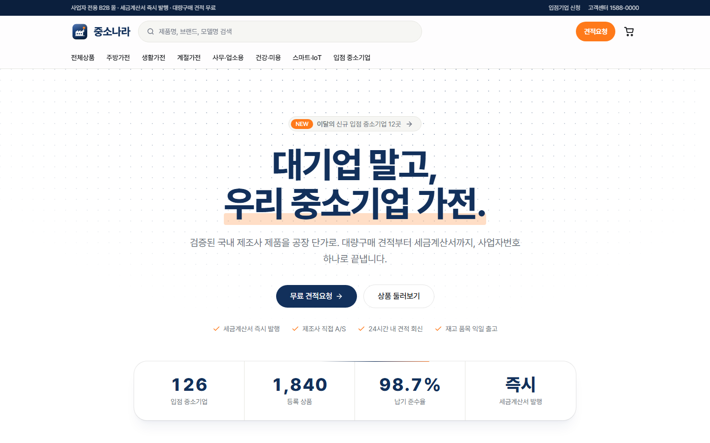

# 중소나라 — 중소기업 가전 B2B 납품몰

> 대기업 말고, 우리 중소기업 가전. 사업자 전용 대량구매 · 견적 · 세금계산서.



로컬 디자인/웹뷰 단계. 데이터는 `lib/data.ts` 목업, 장바구니/견적은 localStorage.
인트로 = [shadcn/ui](https://github.com/shadcn-ui/ui)(114k★) + [Magic UI](https://github.com/magicuidesign/magicui)(21k★). 로고 = `public/img/logo-icon.svg` → 파비콘/OG 자동.

## 문서
| 문서 | 설명 |
|---|---|
| [docs/설명서.md](docs/설명서.md) | 구매자 사용법 + 운영/개발 설명서 |
| [docs/포트폴리오.md](docs/포트폴리오.md) | 프로젝트 후기 · 기술 선택 이유 · 트러블슈팅 |
| [docs/slides/index.html](docs/slides/index.html) | 프로젝트 보고서 슬라이드 12장 (브라우저에서 열기, ←→ 이동, E 편집) · [PDF](docs/slides/중소나라_프로젝트보고서.pdf) |

슬라이드는 GitHub 29.5k★ [frontend-slides](https://github.com/zarazhangrui/frontend-slides) 스킬 + Neo-Grid Bold 템플릿(`design.md`)으로 제작.

## 실행
```bash
npm install
npm run dev   # http://localhost:3000
```

## Higgsfield 이미지 생성 (히어로, 상품 20종)
1. https://console.higgsfield.ai 에서 API 키 발급
2. `.env.local` 에 `HF_CREDENTIALS=KEY_ID:KEY_SECRET`
3. `npm run gen:images` → `public/img/*.jpg|png` (있는 파일은 건너뜀, 다시 만들려면 파일 삭제)
   - 모델 바꾸려면 `HF_MODEL=...` (기본 `flux-pro/kontext/max/text-to-image`). 한글 워드마크가 깨지면 텍스트 잘 그리는 모델(Ideogram 등)로.
   - 프롬프트는 `lib/data.ts` 의 `heroPrompts` / 각 상품 `look`

## 서버 연결 (다음 단계)
- 백엔드: Medusa v2 b2b-starter → `lib/data.ts` 를 fetch 로 교체
- 견적: `app/quote/page.tsx` 의 localStorage 저장을 `POST /api/quotes` 로
- 결제: 토스페이먼츠/포트원 → `app/cart/page.tsx` "바로 주문" 활성화
