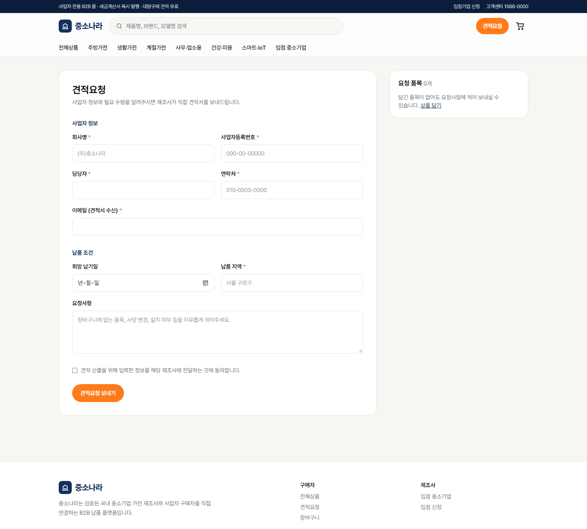
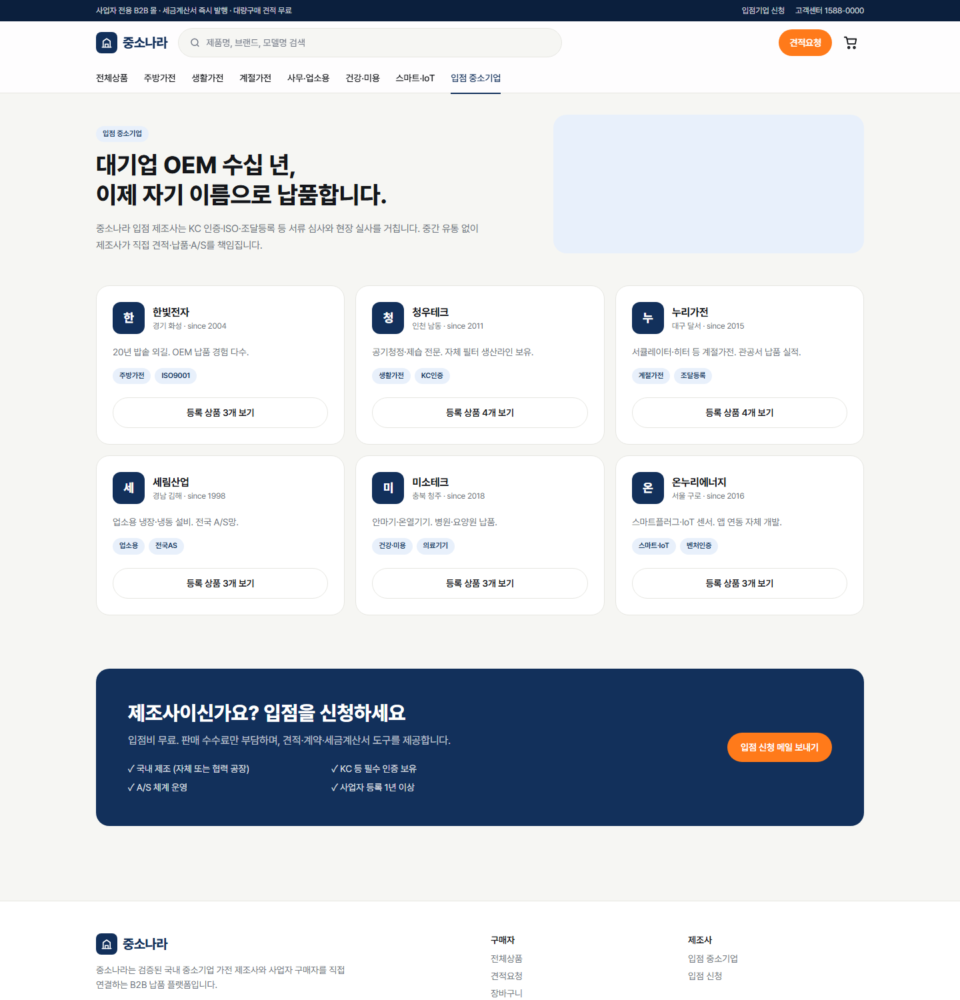

# 중소나라 사용설명서

> 중소기업 가전 B2B 납품몰 — 로컬 웹뷰 버전 (v0.1, 2026-09-18)

## 1. 한눈에 보기

| 항목 | 내용 |
|---|---|
| 서비스 | 중소기업 제조사 ↔ 사업자 구매자 직거래 B2B 가전몰 |
| 핵심 기능 | 상품 탐색 · 장바구니 · **견적요청** · 입점기업 소개 |
| 상태 | 로컬 웹뷰(목업 데이터). 서버·결제 미연결 |
| 실행 | `npm install` → `npm run dev` → http://localhost:3000 |


---

## 2. 구매자 사용법

### 2-1. 상품 찾기
- 상단 메뉴 **전체상품 / 주방가전 / 생활가전 / 계절가전 / 사무·업소용 / 건강·미용 / 스마트·IoT**
- 검색창: 제품명·브랜드·사양 키워드 (예: `공기청정기`, `청우`, `BLDC`)
- 좌측 필터: 카테고리 · 제조사 · **즉시납품**(재고 보유, 익일 출고)


### 2-2. 상품 상세
- 단가(VAT 별도) · **최소주문수량(MOQ)** · 납기 · 주요 사양 · 제조사 정보
- 수량 입력 → **장바구니 담기** 또는 **이 수량으로 견적요청**
- MOQ 미만으로는 수량이 내려가지 않습니다.


### 2-3. 장바구니
- 수량 조절 · 삭제 · 공급가액/부가세/합계 자동 계산
- **이 구성으로 견적요청** → 담긴 품목이 견적 폼에 자동 첨부
- *바로 주문(준비중)*: 결제 연동 후 활성화

### 2-4. 견적요청
1. 사업자 정보(회사명·사업자번호·담당자·연락처·이메일)
2. 납품 조건(희망 납기·지역·요청사항)
3. 개인정보 제공 동의 → **견적요청 보내기**
4. 접수번호(`Q########`) 확인. 제조사가 24시간 내 회신(운영 시)



> 현재 버전은 견적 데이터를 브라우저 `localStorage`(`jsn_quotes`)에만 저장합니다. 서버 연결 시 `POST /api/quotes`로 전송됩니다.

### 2-5. 입점 중소기업
- 제조사 소개 · 인증 태그(KC/ISO/조달등록 등) · 등록 상품 바로가기
- 제조사 입점 신청: 페이지 하단 **입점 신청 메일 보내기**



---

## 3. 운영자·개발자 설명서

### 3-1. 프로젝트 구조
```
jungsonara/
├─ app/                 # Next.js 16 App Router
│  ├─ page.tsx          # 메인 (벤토 히어로·카테고리·베스트·입점기업)
│  ├─ products/         # 목록 (?category= &brand= &lead= &q=) / [handle] 상세
│  ├─ cart/  quote/  brands/
│  ├─ layout.tsx        # 헤더·푸터, 메타데이터
│  └─ globals.css       # 디자인 토큰(@theme) + @utility(btn/card/chip)
├─ components/          # Header · ProductCard · AddToCart · Img(폴백)
├─ lib/
│  ├─ data.ts           # ★ 카테고리 6 · 브랜드 6 · 상품 20 (Medusa 호환 형태)
│  └─ cart.ts           # localStorage 장바구니 store
├─ scripts/gen-images.mjs   # Higgsfield 이미지 생성
├─ public/img/          # 생성 이미지 (없으면 자동 폴백)
└─ docs/                # 설명서 · 포트폴리오 · 슬라이드
```

### 3-2. 상품·브랜드 추가/수정
`lib/data.ts` 만 편집합니다.

```ts
P({ handle: "brand-model", title: "표시명", brand: "hanbit", category: "kitchen",
    price: 189000, moq: 5, lead: "3~5일", badge: "베스트",
    specs: ["사양1", "사양2"], desc: "설명", look: "영문 이미지 프롬프트용 외형 설명" })
```
- `handle` = URL(`/products/{handle}`) = 이미지 파일명(`public/img/{handle}.jpg`)
- `lead: "즉시"` 로 두면 **즉시납품** 필터·배지에 자동 포함
- `badge: "베스트"` 상품이 메인 "이번 주 납품 베스트"에 노출(4개 권장)

### 3-3. Higgsfield 이미지 생성 (로고·히어로·상품)
1. https://console.higgsfield.ai 에서 API 키 발급
2. 프로젝트 루트 `.env.local`:
   ```
   HF_CREDENTIALS=KEY_ID:KEY_SECRET
   ```
3. 실행
   ```bash
   npm run gen:images
   ```
   - 생성물: `public/img/logo-icon.png`(파비콘 `app/icon.png` 자동 교체) · `logo-wordmark.png` · `hero.jpg` · `brands.jpg` · 상품 20종 `.jpg`
   - 이미 있는 파일은 건너뜀 → 다시 만들려면 파일 삭제 후 재실행
   - 모델 변경: `HF_MODEL=...` (기본 `flux-pro/kontext/max/text-to-image`). 한글 워드마크가 깨지면 텍스트 렌더링에 강한 모델(Ideogram 계열)로 교체
   - 동시 생성 수: `HF_CONC=3`
4. 프롬프트 수정: `lib/data.ts` → `heroPrompts` / 각 상품 `look`

### 3-4. 디자인 토큰
`app/globals.css` `:root`
| 토큰 | 값 | 용도 |
|---|---|---|
| `--navy` | `#12305b` | 주색(버튼·로고·강조) |
| `--accent` | `#ff7a1a` | CTA(견적요청) |
| `--bg` / `--surface` | `#f6f6f3` / `#fff` | 배경/카드 |
| 폰트 | Pretendard Variable | 본문·제목 전체 |

### 3-5. 서버 연결 로드맵
| 단계 | 작업 | 위치 |
|---|---|---|
| 1 | Medusa v2 `b2b-starter` 백엔드 기동 | 별도 레포 |
| 2 | `lib/data.ts` → Store API fetch | `lib/data.ts` |
| 3 | 장바구니 → Medusa cart | `lib/cart.ts` |
| 4 | 견적 → `POST /api/quotes` (Medusa Quote 모듈) | `app/quote/page.tsx` |
| 5 | 결제 토스페이먼츠/포트원 어댑터 | `app/cart/page.tsx` "바로 주문" |
| 6 | 사업자 로그인(회사 계정·직원 초대) | Header |

### 3-6. 배포
- GitHub 레포 → Vercel Import → 자동 배포(`main` push마다)
- 환경변수: `HF_CREDENTIALS`는 빌드에 불필요(로컬 생성 스크립트 전용)

---

## 4. 문제 해결
| 증상 | 원인 / 조치 |
|---|---|
| 상품 이미지가 글자 타일로 보임 | `public/img/{handle}.jpg` 없음 → `npm run gen:images` |
| `Cannot apply unknown utility class` | Tailwind v4: 커스텀 클래스는 `@utility`로 정의 (globals.css 참고) |
| 장바구니가 비어 보임 | 브라우저별 localStorage 분리. 시크릿 창은 별도 저장 |
| 3000 포트 사용 중 | `npx next dev -p 3001` |
