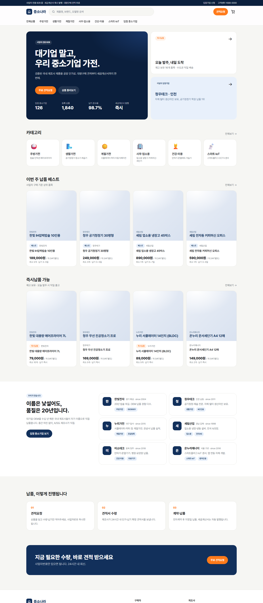
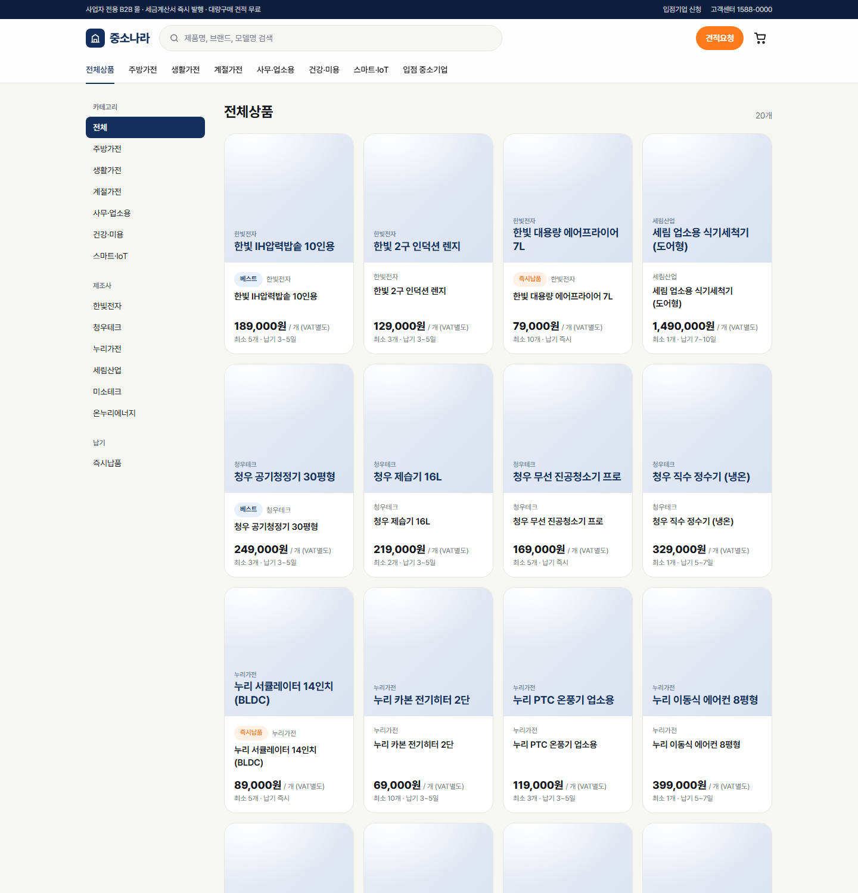
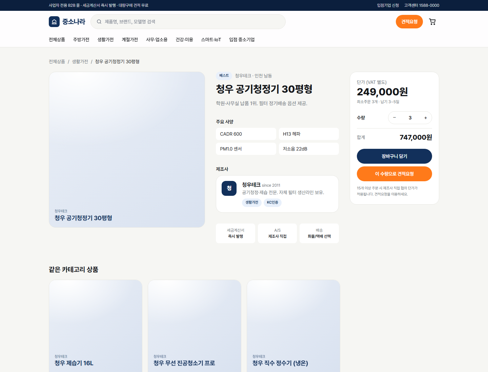
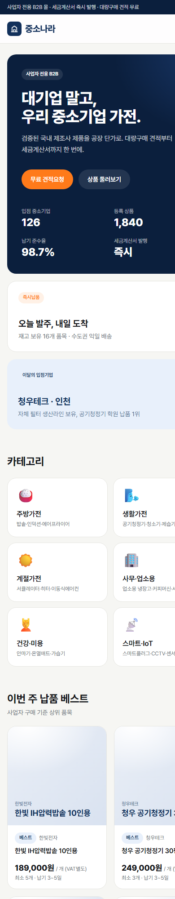

# 중소나라 — 중소기업 가전 B2B 납품몰 만들기 (프로젝트 후기)

> 기간 2026-09-17 ~ 09-18 · 1인 · Next.js 16 + Tailwind v4 · Higgsfield AI 이미지 · Claude Code 페어링

## 왜 만들었나
국내 가전 시장은 대기업 브랜드가 유통을 쥐고 있고, 수십 년 OEM을 해온 중소 제조사는 자기 이름으로 팔 채널이 거의 없다. 반대로 학원·식당·펜션·사무실 같은 **소규모 사업자 구매자**는 "대량으로, 세금계산서 끊어서, 견적 받아서" 사고 싶은데 쿠팡식 B2C 몰은 그 흐름이 없다.

그래서 타겟을 **중소기업 제조사 → 사업자 구매자**로 좁혔다. 이름은 **중소나라**. B2C 쇼핑몰의 "담기 → 결제"가 아니라 B2B의 **"담기 → 견적요청 → 견적서 → 납품"** 흐름을 1급 시민으로 두는 것이 이 프로젝트의 핵심 결정이다.

## 무엇을 만들었나

| 페이지 | 역할 |
|---|---|
| 메인 | 벤토 히어로("대기업 말고, 우리 중소기업 가전") · 카테고리 6 · 납품 베스트 · 즉시납품 · 입점기업 · 납품 프로세스 · 견적 CTA |
| 상품 목록 | 카테고리 / 제조사 / 납기 필터 + 검색 |
| 상품 상세 | 단가·**MOQ**·납기·사양·제조사 카드 · 수량 → 담기 / 견적 |
| 장바구니 | 공급가액·VAT 자동계산 · 견적으로 넘기기 |
| 견적요청 | 사업자 정보 + 납품 조건 + 담긴 품목 자동 첨부 |
| 입점기업 | 제조사 스토리·인증 태그 · 입점 신청 |

## 기술 선택과 이유

**스택 선정 (리서치)** — GitHub의 오픈소스 커머스 중 B2B 기능(회사 계정·견적·승인 워크플로)을 갖춘 건 Medusa v2 `b2b-starter`가 사실상 유일했다. Vercel Commerce(11k★)는 예쁘지만 Shopify 종속이라 국내 PG와 맞지 않고, EverShop/Vendure는 GPL이거나 B2B가 얇다. 그래서 **프론트는 Next.js App Router로 먼저 만들고, 데이터 형태를 Medusa product/variant에 맞춰 두었다가 나중에 fetch만 갈아끼우는** 순서를 택했다.

**"로컬에서 디자인·웹뷰 먼저, 서버는 나중에"** — 실제로 이 순서 덕분에 하루 만에 전 페이지를 볼 수 있었다. 장바구니·견적은 `localStorage`로 동작하고, 서버로 옮길 지점은 코드에 `// ponytail:` 주석으로 표시해 뒀다.

**디자인** — 2026년 트렌드(미니멀 + 벤토 그리드 + 마이크로 인터랙션)를 따르되, B2B 신뢰감을 위해 쿠팡식 빽빽한 배너 대신 Linear/Notion 톤. 네이비(`#12305b`) + 오렌지(`#ff7a1a`) 두 색, Pretendard 한 서체. Tailwind v4의 `@theme`/`@utility`로 토큰화해서 색·라운딩을 한 곳에서 바꾼다.

**AI 이미지 (Higgsfield)** — 로고 3D 아이콘·"중소나라" 3D 워드마크·히어로·상품 20종의 프롬프트를 데이터 파일 안에 함께 두고, `npm run gen:images` 한 번으로 `public/img/`를 채우도록 했다. 이미지가 아직 없으면 `` 컴포넌트가 타이포 타일로 폴백하기 때문에 **이미지 없이도 사이트가 완성돼 보인다** — 이게 "디자인 먼저" 워크플로를 가능하게 한 작은 장치다.

## 막혔던 것들

1. **Tailwind v4 `@apply`가 커스텀 클래스를 모른다** — `.btn { @apply ... }` 로 정의한 클래스를 다른 곳에서 `@apply btn` 하면 `Cannot apply unknown utility class`. v4에선 `@utility btn { ... }` 로 선언해야 한다.
2. **SSR 이미지 404를 React `onError`가 놓친다** — 하이드레이션 전에 이미 실패한 ``는 이벤트가 안 온다. 마운트 시 `img.complete && naturalWidth === 0` 을 재확인하는 한 줄로 해결.
3. **AI 모델의 한글 텍스트 렌더링** — 3D 워드마크는 모델이 한글을 잘 깨뜨린다. 텍스트에 강한 모델로 바꿔 끼울 수 있게 `HF_MODEL` 환경변수로 열어 뒀다.
4. **개발 서버 헤드리스 캡처** — `next dev`는 컴파일이 느려 스크린샷이 하이드레이션 전에 찍힌다. 문서용 캡처는 `next build && next start`로.

## 다음 단계
- Medusa `b2b-starter` 연결 (회사 계정 · 견적 모듈 · 승인 워크플로)
- 토스페이먼츠/포트원 결제 어댑터
- Higgsfield 이미지 생성 실행 (API 키 발급 후)
- Vercel 배포 + 커스텀 도메인

## 배운 것
"서버부터"가 아니라 **"보이는 것부터"** 만들면 의사결정이 빨라진다. 데이터 형태만 목적지(Medusa)에 맞춰 두면 프론트를 먼저 완성해도 나중에 버리는 코드가 거의 없다. 그리고 AI 이미지 파이프라인은 **없을 때의 폴백**까지 설계해야 진짜로 워크플로에 들어온다.

---
저장소: `D:\jungsonara` · 문서: [설명서](설명서.md) · [프로젝트 보고서 슬라이드](slides/index.html)
